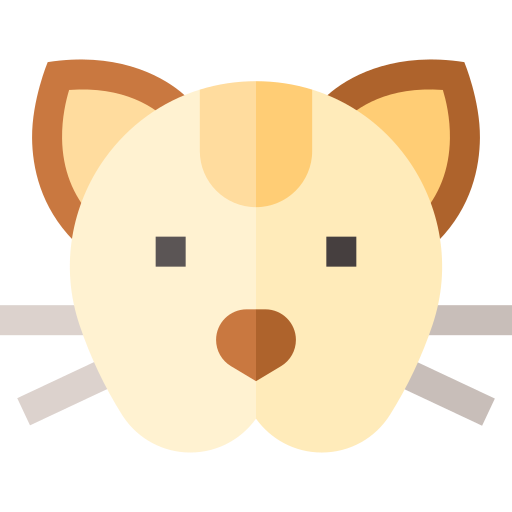
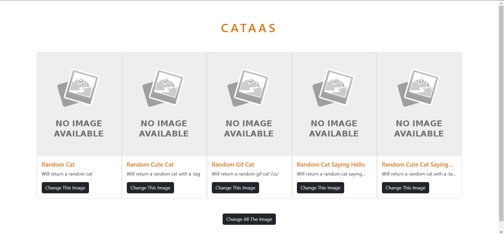
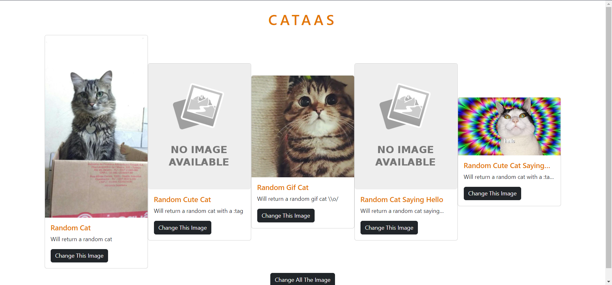
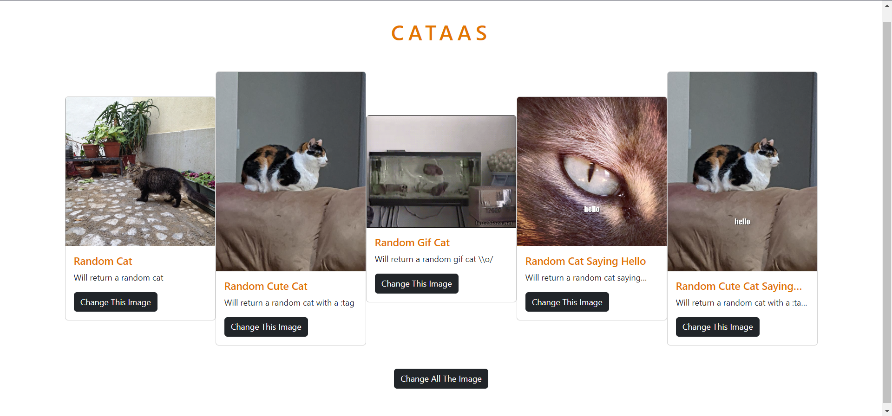

# Async-Await-en-JS

Esta pagina web carga una imagen aleatoria de un gato al presionar un botón.
Utilizando la siguiente API pública: https://cataas.com/#/

  

### Pre-requisitos 📋

* Tener instalado un navegador web como Google Chrome, Brave, tc.

## Ejecutando la aplicación

Al iniciar esta Pagina web vamos a ver una pantalla como la siguiente:

  

Como podemos observar hay 5 cards diferentes las cuales van a llamar diferentes links que nos brindaran diferentes tipos de imagenes:

`https://cataas.com/cat`
`https://cataas.com/cat/cute`
`https://cataas.com/cat/gif`
`https://cataas.com/cat/says/hello`
`https://cataas.com/cat/cute/says/hello`

Dichas url nos van a regresar una imagen y/o Gif de un Gato.
Entonces al presionar el boton correspondiente de un Card nos va a cargar la imagen en dicho card.

  

Como podemos observar debajo de todas las Card se encuentra un botón extra el cual se va a encargar de llamar a todas las URL y mostrar la imagen correspondiente dentro de cada Card de esta manera:

  

## Tech Stack 🛠️

* Visual Studio Code
* Brave

## Autor ✒️

* **Jonatan Morales** - *Estudiante de Ingenieria En Tecnologias De Informacion Y Comunicaciones* - [Jonatan Arturo Morales Tavera](https://www.linkedin.com/in/jonatan-arturo-morales-tavera-3b825b240/)

## Materia

* Desarrollo Web En Pila Completa I

## Escuela

* Instituto Tecnologico Gustavo A. Madero

## Licencia 📄

Este proyecto está bajo la Licencia (Tu Licencia) - mira el archivo [LICENSE.md](LICENSE.md) para detalles

## Expresiones de Gratitud 🎁

* Comenta a otros sobre este proyecto 📢